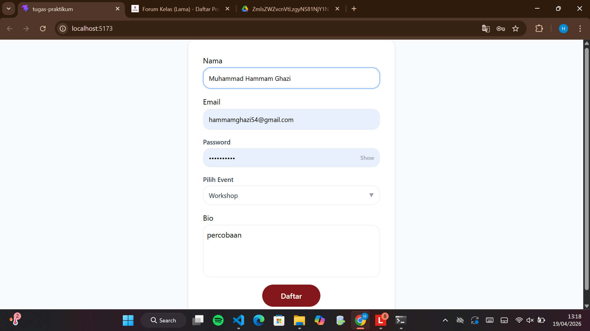

# Form Pendaftaran — Tugas Praktikum

## Tampilan Form & Validasi

Form menampilkan pesan error di bawah setiap field apabila input tidak valid saat tombol Daftar diklik.

Pesan error yang muncul:
- **Nama harus diisi** — jika field kosong
- **Format email tidak valid** — jika email tidak sesuai format
- **Password minimal 8 karakter** — jika password kurang dari 8 karakter
- **Event harus dipilih** — jika dropdown belum dipilih

---

## Form Terisi

Contoh form yang sudah diisi dengan benar sebelum submit.

---

## Custom Dropdown

Dropdown "Pilih Event" dibuat custom dengan 3 pilihan: **Workshop**, **Seminar**, dan **IT Competition**. Pilihan aktif ditandai warna biru, dan ikon panah berubah arah saat dropdown dibuka.

